### 👋 Hello there! I'm Ananda

Currently working on **GeoAI**, **spatial data quality**, and **urban analytics**

<br/>

🎓 &nbsp;Fresh graduate in Cartography and Remote Sensing, Universitas Gadjah Mada

💼 &nbsp;Open to opportunities in GeoAI, remote sensing, and spatial data engineering

🌏 &nbsp;I like to talk about GeoAI and open geospatial data

🧰 &nbsp;Building [**GeoQC**](https://github.com/nandaisnanda/GeoQC) — a Python toolkit for geospatial data quality control

📫 &nbsp;Reach me at [anandashabrinaputrig@mail.ugm.ac.id](mailto:anandashabrinaputrig@mail.ugm.ac.id)

<br/>

## Favorite Tech

Tools, languages, and other things that I like to work with. This doesn't indicate my skill level.

<p>
  &nbsp;&nbsp;
  &nbsp;&nbsp;
  &nbsp;&nbsp;
  &nbsp;&nbsp;
  &nbsp;&nbsp;
  &nbsp;&nbsp;
  &nbsp;&nbsp;
  &nbsp;&nbsp;
  
</p>

<p>
  &nbsp;&nbsp;
  &nbsp;&nbsp;
  &nbsp;&nbsp;
  &nbsp;&nbsp;
  &nbsp;&nbsp;
  &nbsp;&nbsp;
  &nbsp;&nbsp;
  &nbsp;&nbsp;
  
</p>

<br/>

## Geospatial Stack


<br/>

## Featured Project

**[GeoQC](https://github.com/nandaisnanda/GeoQC)** — detects geometry defects and repairs topology with minimal shape change. One validation engine, three surfaces: Python API, CLI, and web app.

```bash
pip install geoqc
```
