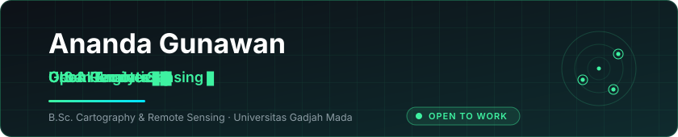

<div align="center">



<br/>


<br/>

### 🛰️ `GeoAI · GIS · Fernerkundung`

**mostly learning how machines see Earth.**  
`我喜欢地图` · `.tif > .jpg` · `maps < data` · *still figuring things out* 🚶🏻‍♀️

<br/>


</div>

---

## `anan@earth:~$ whoami` 🌏

```yaml
name: Anan
species: human... probably
location: somewhere_under_a_satellite 🛰️

studied:
  Cartography & Remote Sensing

currently:
  learning: how machines understand Earth
  building: geospatial things
  breaking: code occasionally
  fixing: geometries repeatedly
  wondering: "warum funktioniert das nicht?"

likes:
  - satellites
  - maps
  - graphs
  - spatial data
  - tiny pixels with geographic meaning
  - unnecessarily large GeoTIFFs

status: still figuring things out 🚶🏻‍♀️
```

<div align="center">


</div>

---

## 🌍 `what's going on in my brain?`

```text
                         🛰️
                    SATELLITE
                        │
                        ▼
                 🌍 tiny planet
                        │
           ┌────────────┼────────────┐
           ▼            ▼            ▼
          GIS          GeoAI        RS
           │            │            │
           └────────────┼────────────┘
                        ▼
                       🧠
                  anan's brain
                        │
        ┌───────────────┼───────────────┐
        ▼               ▼               ▼
      graphs          pixels         databases
        │               │               │
        └───────────────┼───────────────┘
                        ▼
                "wait... why?"
                        │
                        ▼
                    🐛 debug
                        │
                        ▼
                 ✨ it works ✨
                        │
                        ▼
                   🐛 new bug
```

---

## 🛰️ `main rabbit holes`

**GeoAI / Remote Sensing / GIS**

Mostly trying to understand how geography and machine learning can stop pretending they don't know each other.

`spatial ML` · `graph learning` · `satellite imagery` · `SAR` · `urban networks`

<br/>

**Spatial Data Engineering**

Because apparently spatial data does not clean itself. Schade.

`PostGIS` · `GeoParquet` · `GDAL` · `GeoPandas` · `STAC`

<br/>

**other suspicious rabbit holes**

`AI` · `crypto` · `cybersec` · `Linux` · `data engineering`

Do I fully understand all of them?

**nein.**

Do I keep reading about them anyway?

**当然 😭**

---

<div align="center">

### `currently entering rabbit holes...`


</div>

---

## 🧰 `things I poke until they work`

### `geo/`


### `earth observation/`


### `machines/`


### `data/`


---

## 🧹 `currently building: GeoQC`

<div align="center">

<a href="https://github.com/nandaisnanda/GeoQC">

</a>

</div>

A tiny attempt at making geospatial QA/QC a little less painful.

```text
messy.geojson
     │
     ▼
   🧹 GeoQC
     │
     ├── geometry?
     ├── CRS?
     ├── schema?
     ├── duplicates?
     └── suspicious spatial nonsense?
             │
             ▼
        hopefully better ✨
```

Why?

Because:

```python
gdf.is_valid.all()
```

should not be an emotionally significant event.

**noch in Arbeit. 还在学习. still building.** 🛠️

---

## 🧠 `research brain`

```python
anan.brain = [
    "GeoAI",
    "Graph Neural Networks",
    "Spatial Machine Learning",
    "Remote Sensing",
    "SAR + Optical Fusion",
    "Spatial Statistics",
    "Urban Networks",
    "Spatial Data Quality",
]

while True:
    anan.learn()
    anan.break_something()
    anan.google("why does this not work")
```

---

## 📡 `how I see remote sensing`

```text
            ☀️
            │
            ▼
       🌍 EARTH 🌍
       ╱         ╲
      ╱           ╲
     ▼             ▼
Sentinel-2      Sentinel-1
  👁️              📡
optical           SAR
   │               │
   │    clouds ☁️  │
   │     😭        │
   │               │
   └───────┬───────┘
           ▼
          🧠
       machine
           │
           ▼
   "ah yes, pixels"
```

Sentinel-2 when clouds exist:

`tschüss 👋`

Sentinel-1:

`kein Problem. 📡`

---

## 🗺️ `important opinions`

```diff
+ .tif > .jpg
+ data > pretty maps
+ geography matters
+ topology contains information
+ reproducibility is sexy
+ PostGIS deserves more love
+ satellites are cool

- measuring distance in EPSG:4326
- random spatial train/test splits
- unnamed coordinate systems
- final_final_REAL_v7.shp
```

`地图很好看，但数据更重要。`

---

## 🐛 `typical day`

```text
07:30  💻 Büro
07:31  ☕ initializing human.exe
08:00  🛰️ pixels
09:17  🐛 bug
10:42  🐛 different bug
11:58  "warum???"
12:00  🍜 finally
12:47  💡 wait I KNOW
13:02  ✨ fixed
13:04  🐛 regression
15:30  🗺️ map appears
15:31  wrong CRS
16:50  git commit -m "pls work"
17:00  🏃 raus aus dem Büro
21:00  🌙 sudo shutdown now
21:03  🧠 remembers interesting paper
21:04  熬夜?
21:04  NEIN 😭
```

---

## 🖥️ `anan@earth:~$ systemctl status`

```yaml
anan.service:
  status: active (learning)

brain:
  geoai:      █████████░  90%
  gis:        █████████░  90%
  rs:         ████████░░  80%
  crypto:     ████░░░░░░  rabbit-hole
  cybersec:   ████░░░░░░  rabbit-hole
  german:     ███░░░░░░░  versucht es 😭
  chinese:    ██░░░░░░░░  慢慢来

coffee:
  ███░░░░░░░  kritisch

social_battery:
  ████░░░░░░

satellite:
  🟢 connected

geometry:
  🟡 probably valid
```

---

## 🕐 `ping policy`

```text
┌──────────────────────────────────────────┐
│              ANAN NETWORK                │
├──────────────────────────────────────────┤
│  💻 Büro        │ 07:30 ─────── 17:00   │
│  🍜 fast reply  │ 12:00 ─────── 13:00   │
│  🐌 sonst       │ high latency          │
│  🌙 shutdown    │ 21:00                 │
└──────────────────────────────────────────┘
```

During office hours I'm probably working, staring at a terminal, or arguing with geographic data.

**Best ping window:** `12:00–13:00`

Outside that?

`Antwort kommt... irgendwann™`

At `21:00`:

```bash
sudo shutdown -h now
```

熬夜?

**nein. 😭**

---

## 🐍 `contribution wildlife`

<div align="center">

<picture>
  <source
    media="(prefers-color-scheme: dark)"
    srcset="https://raw.githubusercontent.com/nandaisnanda/nandaisnanda/output/github-contribution-grid-snake-dark.svg"
  />
  <source
    media="(prefers-color-scheme: light)"
    srcset="https://raw.githubusercontent.com/nandaisnanda/nandaisnanda/output/github-contribution-grid-snake.svg"
  />
  
</picture>

<br/>

<sub>
🐍 Python eating my contributions instead of my RAM for once.
</sub>

</div>

---

## 📊 `github telemetry`

<div align="center">


<br/><br/>


<br/><br/>


</div>
---

## 📊 `github telemetry`

<div align="center">


<br/>


<br/>


</div>

---

## 🗃️ `~/anan`

```text
anan/
│
├── 🛰️ satellites/
│   ├── sentinel_1/
│   ├── sentinel_2/
│   └── clouds_are_annoying/
│
├── 🌍 geo/
│   ├── gis/
│   ├── networks/
│   ├── topology/
│   └── why_is_the_crs_wrong/
│
├── 🧠 ai/
│   ├── spatial_ml/
│   ├── graphs/
│   └── model_final_final_REAL.pt
│
├── 🧹 GeoQC/
│   └── please_be_valid.geojson
│
├── 🐇 rabbit_holes/
│   ├── crypto/
│   ├── cybersec/
│   ├── linux/
│   └── probably_another_one_tomorrow/
│
└── 🍜 lunch/
    └── 12_00_13_00_ONLY
```

---

## 🛸 `incoming transmission...`

<div align="center">


<br/>

### `AI / RS / crypto / cybersec rabbit holes?`

**gern, ping me. 🛰️**

I'm probably not an expert.

I'm probably curious.

That's usually enough to start a good conversation.

<br/>

<a href="mailto:anandashabrinaputrig@mail.ugm.ac.id">

</a>

<a href="https://github.com/nandaisnanda">

</a>

<a href="https://github.com/nandaisnanda/GeoQC">

</a>

<br/><br/>


### `bis später · 再见 · see ya!` 🛰️

<sub>
`.tif > .jpg` &nbsp;·&nbsp;
`maps < data` &nbsp;·&nbsp;
`EPSG matters`
</sub>

</div>
